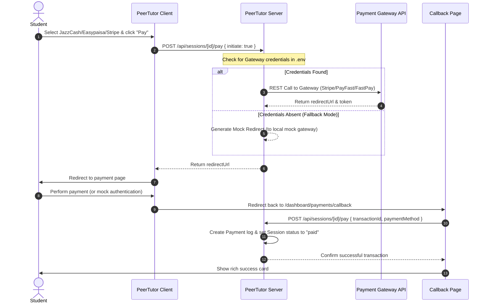

# PeerTutor - Peer-to-Peer University Tutoring Platform

PeerTutor is a premium, full-stack peer-to-peer university tutoring platform designed to connect students with experienced student-tutors. It supports search, real-time availability scheduling, interactive chats, automated invoice generation, and full checkout integration with multiple payment gateways.

---

## 🚀 Key Architectural Pillars

PeerTutor is designed with an production-grade architecture that showcases strong backend engineering principles:
*   **Decoupled Multi-Gateway Payment System**: Integrates Stripe (for global card payments), PayFast (for Pakistani localized channels like JazzCash/Easypaisa), and FastPay (for Iraqi mobile wallets). Fallback logic automatically spins up fully functional local sandbox mocks if merchant credentials are left unconfigured.
*   **State-Driven Session Workflow**: Implements a robust state machine for session scheduling, payment execution, tutor verification, and rating collection.
*   **Real-time Bi-directional Messaging**: Managed using Next.js Custom WebSocket handles and Socket.io for instantaneous student-tutor messaging.
*   **Aggregated Analytics**: Features detailed dashboards for tracking platform fees, tutor earnings (85% payouts), and monthly breakdowns.

---

## 🛠️ Technology Stack

| Layer | Technologies |
| :--- | :--- |
| **Frontend** | Next.js 15 (App Router), React 19, TypeScript |
| **Styling** | Vanilla Tailwind CSS 4 with custom global color variables & Glassmorphic interfaces |
| **Database** | MongoDB with Mongoose (highly-indexed schema design) |
| **Authentication** | JWT with secure, HTTP-Only, SameSite cookies |
| **Real-time Engine** | Socket.io server running alongside Next.js REST API |
| **Documentation** | Mermaid.js diagrams, detailed developer setup, database seeds |

---

## 📂 Project Structure

```
├── src/
│   ├── app/                      # Next.js App Router Pages & APIs
│   │   ├── api/                  # REST APIs
│   │   │   ├── auth/             # Registration, Login, HttpOnly Session Cookie APIs
│   │   │   ├── sessions/         # Scheduling, Reviews, & Gateway Checkout APIs
│   │   │   ├── tutor/            # Withdrawals & Earnings aggregation APIs
│   │   │   └── messages/         # Conversations & Messaging APIs
│   │   ├── dashboard/            # High-fidelity dashboard panels (Tutor / Student views)
│   │   │   ├── payments/         # Payment callbacks, invoices, & interactive mock gateways
│   │   │   └── sessions/         # Session tracking lists
│   ├── components/               # Shareable UI widgets
│   ├── features/                 # Modular domain features (earnings, search, payments)
│   │   ├── payments/             # checkout modals, invoices viewer
│   │   └── sessions/             # server side REST endpoint handlers
│   ├── models/                   # Strictly typed Mongoose models
│   │   ├── User.ts               # Core Student/Tutor account settings
│   │   ├── Session.ts            # Bookings and scheduling ledger
│   │   ├── Payment.ts            # Checkout transactions log
│   │   ├── Withdrawal.ts         # Tutor payout ledger
│   │   └── Invoice.ts            # PDF-ready invoice metadata
│   └── lib/                      # Base utilities & SDK integrations
│       ├── paymentService.ts     # PayFast / FastPay / Stripe checkout API client
│       ├── auth.ts               # Token sign/verify helper
│       └── db.ts                 # Mongoose connection pooling
```

---

## 💳 Payment Gateway Integration Flow



---

## ⚙️ Installation & Developer Guide

### 1. Prerequisites
*   Node.js 18+ installed on your local machine
*   MongoDB instance (local community server or MongoDB Atlas cluster)

### 2. Setup Files
1.  Clone the repository and install dependencies:
    ```bash
    git clone <repository-url>
    cd PeerTutor
    npm install
    ```

2.  Initialize configuration variables. Copy `.env.example` to `.env`:
    ```bash
    cp .env.example .env
    ```

3.  Configure variables inside `.env`:
    ```env
    MONGODB_URI=mongodb://localhost:27017/peertutor
    JWT_SECRET=your-secret-key-change-this-for-production
    NEXT_PUBLIC_API_URL=http://localhost:3000
    
    # Configure payment credentials to verify actual API communication:
    FASTPAY_MERCHANT_MOBILE=
    FASTPAY_STORE_PASSWORD=
    PAYFAST_MERCHANT_ID=
    PAYFAST_SECURED_KEY=
    STRIPE_SECRET_KEY=
    ```
    *If left blank, the platform automatically redirects payments to our highly-engaging local sandbox checkout simulation.*

### 3. Database Seeding (Optional)
Run the built-in database seeding scripts to instantly populate your dashboard with realistic transaction histories, tutor records, and pending bookings:
```bash
# Seed initial users & tutors (ensure MongoDB is running)
npx ts-node scripts/cleanup-users.ts

# Seed realistic earnings, payments, and invoice ledger items
npx ts-node scripts/seed-payments.ts
```

### 4. Running the Development Server
```bash
npm run dev
```
Open [http://localhost:3000](http://localhost:3000) to view the application.

---

## 🎯 Verification & Testing Checklist

Recruiters or developers can test the complete end-to-end payment loop using these steps:
1.  **Register / Login**: Sign up as a **Student** and navigate to search for available Tutors.
2.  **Schedule a Session**: Click **Book Session**, select an open slot, and send the request.
3.  **Approve Session**: Log out and sign in as the designated **Tutor** (or use seeded credentials). Go to **My Sessions** and click **Accept**.
4.  **Execute Payment**: Log back in as the **Student**. Find the accepted booking and click **Pay Now**.
5.  **Secure Redirect**:
    *   Choose **JazzCash / Easypaisa** or **Stripe Card**.
    *   Clicking **Pay** calls the checkout backend. You will be automatically redirected to the Sandbox gateway.
    *   Enter dummy verification credentials (e.g., OTP or test numbers) and click **Verify**.
6.  **Invoice Generation & Payouts**: On successful redirection callback, view the details of the automatically populated invoice ledger item. Log in as the tutor to review the earnings split.
