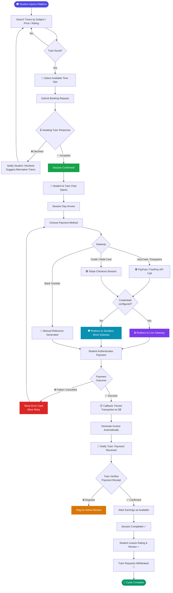
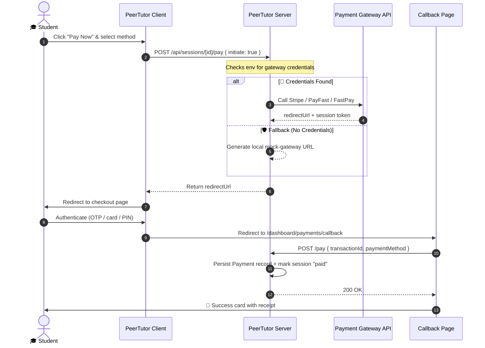

# PeerTutor — Peer-to-Peer University Tutoring Platform

> 🎓 **Book tutors. Pay securely. Learn better.** — A full-stack tutoring marketplace for university students.

[](https://nextjs.org/)
[](https://typescriptlang.org/)
[](https://mongoosejs.com/)
[](https://socket.io/)
[](https://stripe.com/)

---

PeerTutor is a production-grade peer-to-peer tutoring marketplace where students find, book, and pay tutors — all without leaving the platform. It supports real-time chat, automated invoice generation, multi-gateway payment checkout, and per-role dashboards for students and tutors.

---

## 🚀 Key Architectural Pillars

- **Decoupled Multi-Gateway Payments**: Integrates Stripe, PayFast (JazzCash/Easypaisa), and FastPay. Auto-switches to interactive local sandbox mocks if credentials are absent — so the flow is always testable.
- **State-Machine Session Lifecycle**: Sessions advance through explicit states (`pending → accepted → paid → verified → reviewed`), preventing invalid transitions server-side.
- **Real-time Messaging**: Socket.io WebSocket server co-deployed alongside the Next.js API — shared auth, minimal overhead.
- **Role-Aware Dashboards**: Students see bookings and payment history; Tutors see earnings, withdrawal ledger, and per-session verification queue.

---

## 🛠️ Tech Stack

| Layer | Technology |
| :--- | :--- |
| **Frontend** | Next.js 15 (App Router), React 19, TypeScript |
| **Styling** | Tailwind CSS 4 with custom design tokens & glassmorphic UI |
| **Database** | MongoDB + Mongoose with compound indexes |
| **Auth** | JWT in HTTP-Only, SameSite=Lax cookies |
| **Real-time** | Socket.io — bidirectional messaging channel |
| **Payments** | Stripe Checkout · PayFast · FastPay (+ local sandbox fallback) |

---

## 🗺️ Session Lifecycle — Activity Diagram

> From the moment a student searches to a tutor getting paid — every state, every actor, every branch.



---

## 💳 Payment Gateway Sequence



---

## 📂 Project Structure

```
src/
├── app/
│   ├── api/
│   │   ├── auth/               # Register · Login · Logout · Delete account
│   │   ├── sessions/[id]/      # Booking CRUD · Pay · Verify · Review
│   │   ├── tutor/              # Earnings · Withdrawals · Invoices
│   │   └── messages/           # Conversations · Send · Mark read
│   └── dashboard/
│       ├── payments/
│       │   ├── callback/       # Post-redirect status verification
│       │   └── mock-gateway/   # Interactive sandbox checkout emulator
│       └── sessions/           # Student & Tutor session tables
├── features/
│   ├── payments/               # PaymentGatewayModal · InvoiceViewer
│   └── sessions/               # All session REST handlers (server-side)
├── models/
│   ├── User.ts · Session.ts · Payment.ts
│   ├── Withdrawal.ts · Invoice.ts
│   └── Message.ts · Conversation.ts
└── lib/
    ├── paymentService.ts       # FastPay · PayFast · Stripe API clients
    ├── auth.ts                 # JWT sign / verify
    └── db.ts                   # Mongoose connection pool
```

---

## ⚙️ Setup & Installation

### Prerequisites
- Node.js 18+
- MongoDB (local or Atlas)

### Steps

```bash
# 1. Clone & install
git clone https://github.com/HaseebUllahButt/PeerTutor.git
cd PeerTutor
npm install

# 2. Configure environment
cp .env.example .env
# Edit .env — at minimum set MONGODB_URI and JWT_SECRET
# Leave payment keys blank → automatically uses sandbox mock gateways

# 3. (Optional) Seed demo data
npx ts-node scripts/seed-payments.ts

# 4. Start dev server
npm run dev
```

Open [http://localhost:3000](http://localhost:3000)

---

## 🎯 End-to-End Testing Checklist

| Step | Action |
| :--- | :--- |
| 1️⃣ Register | Sign up as **Student** |
| 2️⃣ Book | Search → select tutor → pick slot → submit |
| 3️⃣ Accept | Log in as **Tutor** → My Sessions → Accept |
| 4️⃣ Pay | Back as **Student** → Pay Now → choose JazzCash / Stripe |
| 5️⃣ Gateway | Redirected to checkout (live or sandbox mock) |
| 6️⃣ Callback | Automatic redirect back → success card shown |
| 7️⃣ Verify | Tutor confirms receipt of payment |
| 8️⃣ Withdraw | Tutor requests payout to JazzCash / bank |

---

## 🔌 API Reference

| Method | Endpoint | Description |
| :--- | :--- | :--- |
| `POST` | `/api/auth/register` | Register student or tutor |
| `POST` | `/api/auth/login` | Login & receive session cookie |
| `GET` | `/api/sessions` | List all sessions for current user |
| `POST` | `/api/sessions/[id]/pay` | Initiate or finalize payment |
| `POST` | `/api/sessions/[id]/verify-payment` | Tutor confirms receipt |
| `GET` | `/api/tutor/earnings` | Earnings breakdown with monthly chart data |
| `POST` | `/api/tutor/withdraw` | Request withdrawal to mobile wallet / bank |
| `POST` | `/api/messages` | Send real-time chat message |
